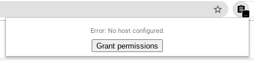
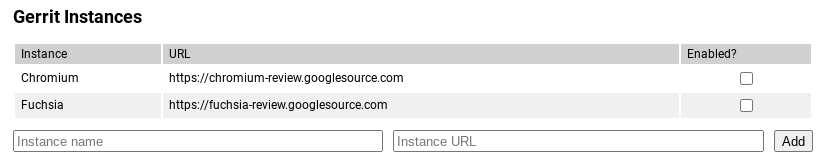
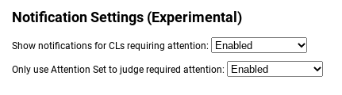

# Chrome extension to monitor gerrit code review

This repository contains source code for the [Chrome Gerrit Monitor][1]
extension.

## About the extension

This is the first Chrome extension I've ever wrote, so I would not
recommend using it as an example on how to write a good extension.

The extension polls the gerrit servers registered every five minutes
and update the extension badge. On click, it also polls the server to
display the popup (and refresh the badge).

This extension has been developed primarily for my work on Chromium,
so it should work as provided for this gerrit installation. It may
fail for other server, especially if they have not enabled the JSON
rest API.

The extension tries to limit as much as possible the permission that
it requests. By default, it needs no permission, and will request the
permission to access pages from gerrit servers the user has configured.

## Installation

The simplest way to install the extension is to visit the Chrome Web
Store and click the install button.

If you want to develop the extension, then you can check out this repo,
navigation to chrome://extensions, and use the "Load unpacked" to point
to the checkout `src/` directory.

To deploy, you can use the `deploy.py` script or use the "Pack extension"
button from chrome://extensions.

## Setup

Installing Gerrit Monitor is not enough to start getting push notifications;
you need to configure the extension for all Gerrit hosts that interest you.

After downloading the extension, click on it and click the button
saying "Grant permissions".

From here, a page will load where you can enable any Gerrit instances that
interest you. Click the checkbox on the "Enabled?" column to enable Chromium
or Fuchsia, or custom add additional instances using the boxes at the bottom.

Attention Set support in Gerrit Monitor is experimental. If interested, switch
either or both boxes to "Enabled".

## License

The project is licensed under the Apache 2.0 license.

Every file containing source code must include copyright and license
information. This includes any JS/CSS files that you might be serving out to
browsers. (This is to help well-intentioned people avoid accidental copying that
doesn't comply with the license.)

Apache header:

    Copyright 2018 Google LLC

    Licensed under the Apache License, Version 2.0 (the "License");
    you may not use this file except in compliance with the License.
    You may obtain a copy of the License at

        https://www.apache.org/licenses/LICENSE-2.0

    Unless required by applicable law or agreed to in writing, software
    distributed under the License is distributed on an "AS IS" BASIS,
    WITHOUT WARRANTIES OR CONDITIONS OF ANY KIND, either express or implied.
    See the License for the specific language governing permissions and
    limitations under the License.

## Disclaimer

This is not an officially supported Google product.

[1]: https://chrome.google.com/webstore/detail/gerrit-monitor/leakcdjcdifiihdgalplgkghidmfafoh
